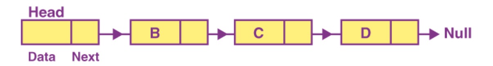
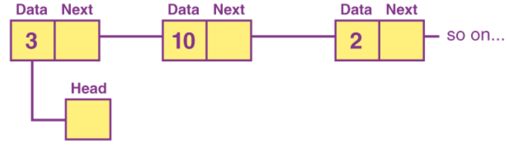
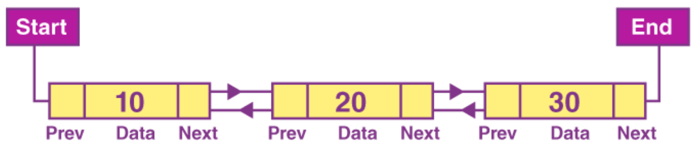
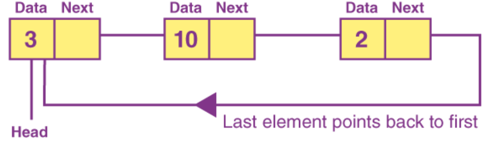

# LinkedList

Linkedlist is a form of sequential collection and it does not have to be in order. A linked list is made up of independent nodes that may contain any type of data and each node has a reference to the next node in the link.

A linked list is a sequence of data structures. It also known as a linear data structure that comprises a set of connected nodes. Each node is used to store the data and also the address to the next node.

## Singly Linked List

It is the simplest form of linkedlist in which every node contains a data and an address to the next node. In a singly linked list we can perform insertion, deletion, and transversal.

## Doubly Linked List

It's a different type of linked list where each node holds the data, the address to the next node and also the address to the previous node.

## Circular Singly Linked List

In this type of linked list the tail contains no only data but the address to the head node.

## Circular Doubly Linked List

In this type of linked list the tail contains the data, the address to the head node and also the address to the previous node.
