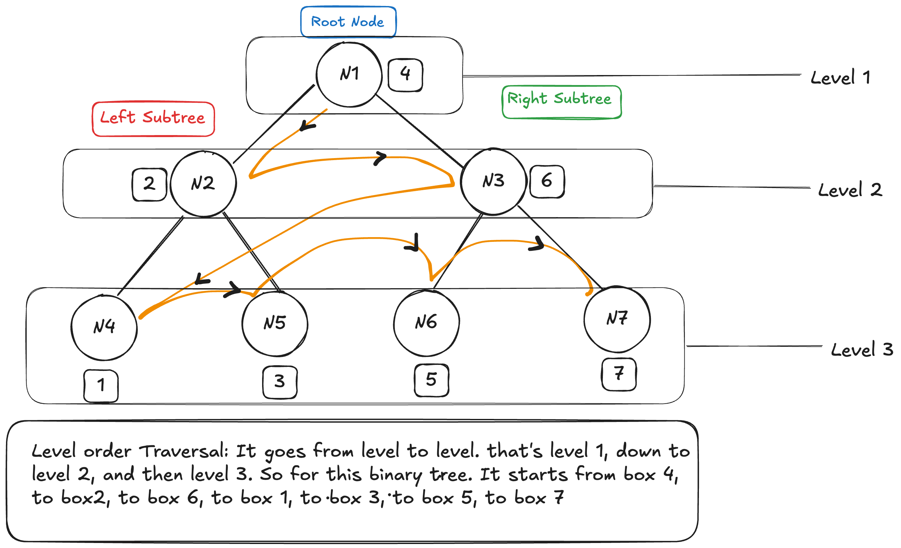
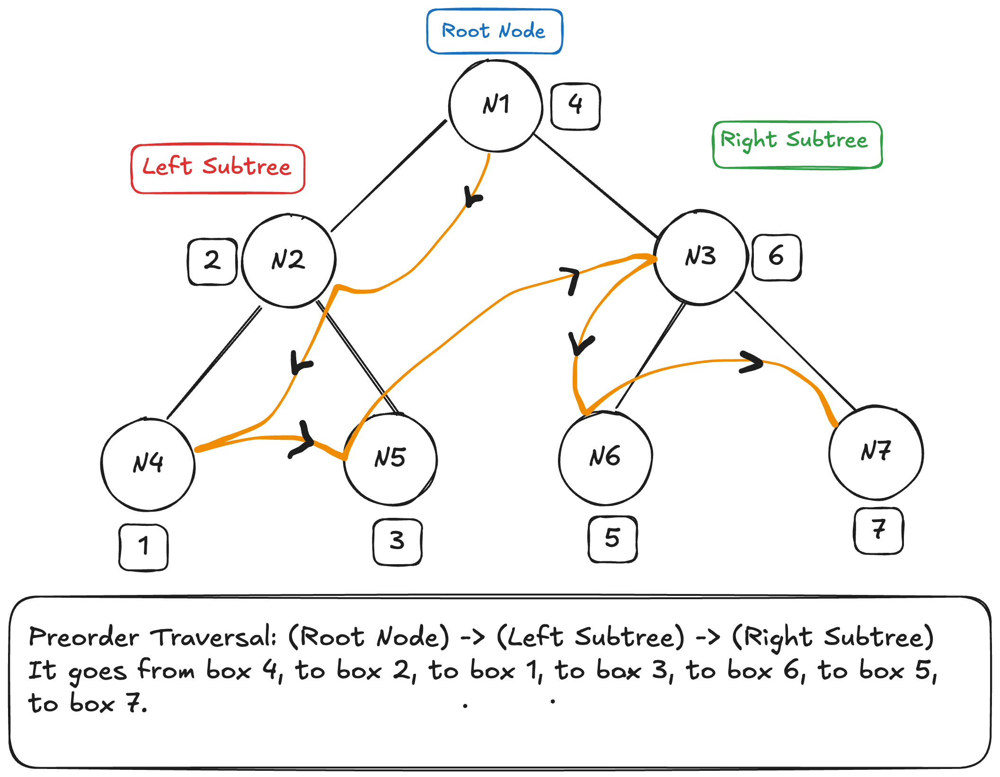
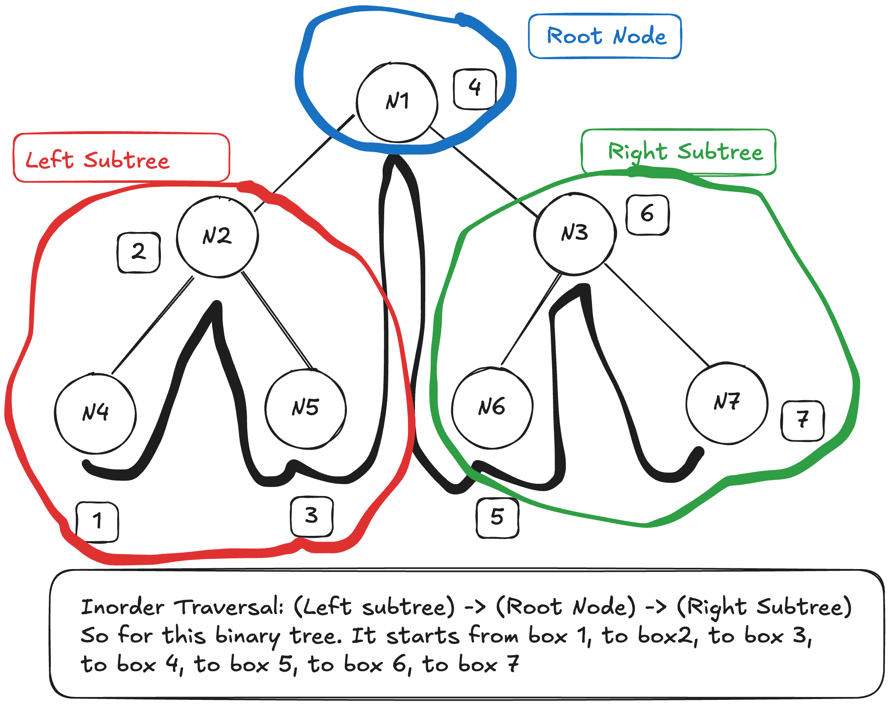
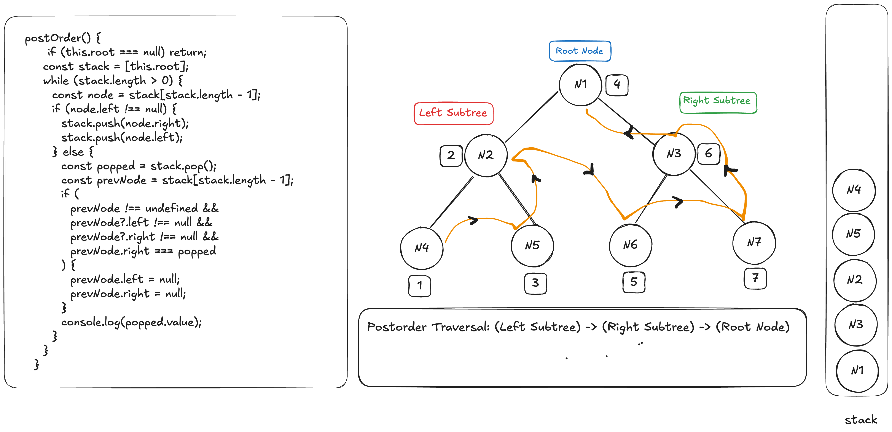

# Binary Tree

A binary tree is a heirarchical data structure where each node has at most two children.

## Types of binary tree:

- Full Binary Tree: A full binary tree is a binary tree where every node has zero or two children only. Every node must have two or zero children.

- Perfect Binary Tree:
  A leaf node have two children and they're at the same depth

- Complete Binary Tree:
  All levels are filled except the last level and all the last level keys are located at left as possible.

- Balanced Binary Tree:
  Each leaf is located in a certain distance from the root node. It means all the leaf nodes are located from the root node in the same distance.

## Binary Tree Traversal

## Depth First Search

- Preorder Traversal
- Inorder Traversal
- Postorder Traversal

## Breadth First Search

Level order Traversal (used in binary tree insert method). The traversal moves from level to level.

### Preorder Traversal

In Preorder traversal we visit the (Root Node) -> (Left Subtree) -> (Right Subtree)
We use the stack data structure (array-implementation) to implement the preorder travsersal. LinkedList isn't advised because it leads to pointer chasing and there's no spatial locality gains and also there's GC (Garbage collection) overhead due to the fact that the logic of linkedlist is non-contiguous memory. Whereas in array implementation we've spatial locality gains, no chances of cache-miss and also no pointer chasing since the memory is contiguous.

### Inorder Traversal

In Inorder traversal we visit the (Left Subtree) -> (Root Node) -> (Right Subtree).

### Postorder Traversal

In Postorder we move from (Left Subtree) -> (Right Subtree) -> (Root Node).
it goes from the box1, to box3, to box2, to box5, to box7, to box6, to box4. We use stacks and a while loop to implement this transversal.

